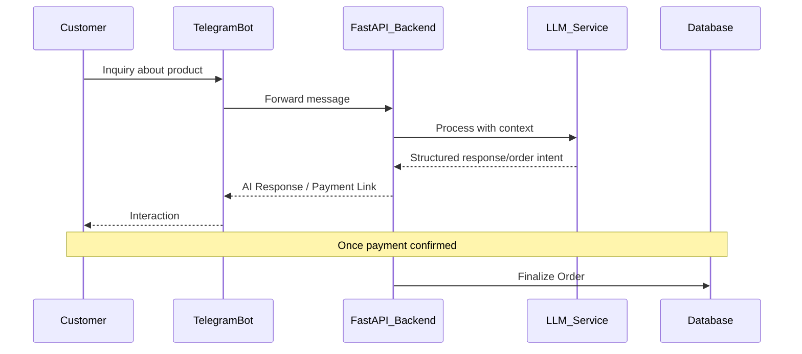

<p align="center">
  
</p>

# Vendly: AI-Powered Social Commerce Ecosystem

<p align="center">
  <strong>Vendly is an AI-powered social commerce platform designed to transform everyday chat conversations into structured, trackable, and scalable business transactions.</strong>
</p>

<p align="center">
  
  
  
  
  
</p>

---

## Overview

We help vendors who sell through platforms like WhatsApp and Telegram move from “Are you available?” to “Payment received” automatically — eliminating manual processes, delays, and missed opportunities.

### Problem
Social media vendors face several operational challenges:
- Constant back-and-forth communication with customers
- High risk of missed or untracked orders
- Lack of centralized inventory and business management tools
- Manual and unreliable payment confirmation processes
- Limited ability to scale beyond one-on-one conversations

### Solution
Vendly provides an integrated system that:
- Automates customer interactions using AI
- Converts conversations into structured orders
- Centralizes inventory, orders, and financial tracking
- Enables secure and verifiable payments
- Provides analytics for data-driven decision-making

---

## Key Features

### AI Sales Assistant
- Handles real-time customer interactions
- Responds to inquiries and negotiates pricing based on vendor-defined context
- Guides customers through the purchase process
- Automatically captures and structures order data

### Vendor Dashboard
- Product and inventory management
- Order tracking and fulfillment monitoring
- Revenue and transaction history tracking
- Business insights through analytics

### Chat Integration
- Direct integration with WhatsApp and Telegram
- Enables seamless communication without redirecting users
- Maintains conversational flow while capturing structured data

### Payment System
- Integration with Interswitch for secure transactions
- Ensures payment verification before order confirmation
- Reduces fraud and failed transactions

### Business Analytics
- Tracks sales performance
- Monitors customer behavior
- Provides actionable insights for growth

---

## Architecture Overview

Vendly is built as a scalable full-stack system consisting of:
- **AI interaction layer** for conversational automation
- **Backend services** for business logic, data processing, and integrations
- **Frontend dashboard** for vendor operations and monitoring
- **Payment infrastructure** for secure transaction handling

---

## Interaction Flow


---

## Tech Stack

- **Frontend**: Next.js 14, TypeScript, Tailwind CSS
- **Backend**: Python 3.12, FastAPI, Prisma ORM
- **AI**: Groq (LLaMA 3 model) with custom vendor-context injection
- **Database**: PostgreSQL
- **Payments**: Interswitch
- **Deployment**: Render

---

## Project Structure
- `backend/`        → FastAPI backend (AI services, APIs, integrations)
- `vendly-web/`     → Next.js frontend dashboard

---

## Getting Started

### Prerequisites
- **Python**: 3.12 or higher
- **Node.js**: v18 or higher (LTS recommended)
- **PostgreSQL**: A running instance (local or hosted)

### Backend Setup (FastAPI)
1. Navigate to the `backend` directory:
   ```bash
   cd backend
   ```
2. Create and activate a virtual environment:
   ```bash
   python -m venv venv
   source venv/bin/activate  # On Windows: venv\Scripts\activate
   ```
3. Install dependencies:
   ```bash
   pip install -r requirements.txt
   ```
4. Configure environment variables:
   - Copy `.env.example` to `.env`
   - Update `DATABASE_URL` with your PostgreSQL connection string
   - Add your `GROQ_API_KEY` for AI features
5. Initialize the database (Prisma):
   ```bash
   prisma db push
   prisma generate
   ```
6. Run the server:
   ```bash
   uvicorn app.main:app --reload
   ```

### Frontend Setup (Next.js)
1. Navigate to the `vendly-web` directory:
   ```bash
   cd ../vendly-web
   ```
2. Install dependencies:
   ```bash
   npm install
   ```
3. Configure environment variables:
   - Copy `.env.example` to `.env.local`
   - Ensure `NEXT_PUBLIC_API_URL` points to your running backend (default: `http://localhost:8000/api/v1`)
4. Run the development server:
   ```bash
   npm run dev
   ```

---

## Test Credentials

You can use the following credentials to explore the vendor dashboard:
- **Email**: `boutique@vendly.app`
- **Password**: `boutique-pass`

> [!TIP]
> You can also go through the **signup process** to create your own store from scratch and test the full onboarding flow.

---

## Team & Contributions

This project was developed collaboratively, with each team member taking ownership of critical system components:

### **abdulbaqeee** — Backend & AI Infrastructure
- Designed and implemented the FastAPI backend architecture for high-concurrency request handling
- Developed core API endpoints for order processing, vendor management, and system communication
- Integrated Groq (LLaMA 3) for AI-driven conversational selling, including vendor-specific context injection
- Built and configured webhook systems for Telegram integrations and prepared architecture for WhatsApp support
- Implemented data validation and schema management using Pydantic and Prisma
- Ensured efficient communication between AI services and backend logic

### **Ubaidah** — Frontend Engineering & User Experience
- Designed and developed the vendor dashboard using Next.js and Tailwind CSS
- Implemented responsive and accessible UI components for seamless cross-device usage
- Built key dashboard features including inventory management, order tracking, and analytics views
- Structured frontend state management and API integration with backend services
- Focused on user experience, ensuring clarity in data visualization and workflow navigation

### **Haleem** — System Integration & Deployment
- Managed integration between backend services, AI systems, and frontend dashboard
- Configured and deployed the application on Render, including backend services and PostgreSQL database
- Ensured system stability, uptime, and environment configuration across production
- Handled database provisioning and optimization for performance
- Conducted end-to-end testing to validate system workflows from chat interaction to order completion

---

## Documentation
- **[Product Overview](docs/product_overview.md)** — System vision, business context, and core feature breakdown
- **[API Documentation](docs/api_documentation.md)** — Endpoint definitions, request/response structures, and auth flows
- **[Product Flow](docs/product_flow.md)** — End-to-end user journey from chat inquiry to confirmed order
- **[WhatsApp Integration Guide](docs/whatsapp_integration_guide.md)** — Setup guide for enabling WhatsApp Commerce

---

## Why Vendly Stands Out
- Designed specifically for chat-based commerce environments
- Combines AI automation, payments, and analytics in a single platform
- Reduces operational overhead for vendors
- Enables scalable selling without increasing manual workload

---

## Implementation Notes

During development, we encountered onboarding limitations with the Meta Developer Console, which prevented full integration of WhatsApp within the project timeline.

**As a result:**
- WhatsApp integration is not included in the current build
- Telegram integration is fully implemented and functional
- All core system features, including AI interaction, order processing, and dashboard synchronization, are actively working through Telegram

The system architecture has been designed to support WhatsApp integration, and this can be completed seamlessly once access to the Meta Developer platform is fully established.

---

## Vision
To enable businesses to operate, sell, and scale directly from conversations by providing intelligent, automated, and secure commerce infrastructure.

---

## Submission Notes
- This is a team-based submission with clearly defined roles and contributions
- All contributors listed above actively participated in the development process
- The system is fully functional and represents the final submission version

---

<p align="center">
  <i>Vendly — Turning conversations into commerce.</i>
</p>