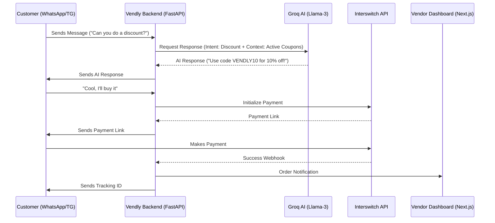

# Vendly: Product Flow

The Vendly ecosystem involves two primary journeys: the **Vendor Lifecycle** and the **Customer-to-Bot Transaction**.

## 1. Vendor Onboarding & Setup Flow
1. **Signup/Login:** Vendor creates an account on the Vendly Next.js dashboard.
2. **Store Configuration:** Sets up their store name, category, and location.
3. **Inventory Upload:** Vendor adds products with details, variants (colors, sizes), technical specs, multiple images, and initial reviews/testimonials.
4. **Bot Deployment:**
    - **WhatsApp:** Vendor completes "Embedded Signup" with Meta to link their WhatsApp Business phone number and retrieve an Access Token.
    - **Telegram:** Vendor creates a bot via [@BotFather](https://t.me/botfather) and pastes the API Token into Vendly. Vendly automatically sets the webhook.
5. **AI Calibration:** Vendor defines the bot's "Persona" (e.g., "Professional Skincare Advisor") and sets "Haggling Thresholds" (e.g., "Can discount up to 10% for returning customers").
6. **Live Status:** The bot is now "Active" and acts as the vendor's digital employee.

## 2. Customer Interaction & Sales Flow
1. **Initial Contact:** Potential customer messages the bot (WhatsApp/Telegram) with a query.
2. **Discovery (AI Engine):**
    - AI analyzes the query using Groq (Llama-3).
    - AI queries the backend `/inventory` for relevant products and their **variants**.
    - If asked for "other colors," AI iterates through the variant list.
    - If asked for "images," AI sends additional image URLs from the product gallery.
    - If asked for "reviews," AI summarizes the customer feedback stored in the DB.
    - AI provides descriptive discovery (Sizing, specs, advisor-style recommendations).
3. **Negotiation (AI + Pre-defined Coupons):**
    - Customer asks for a discount or a "better price."
    - AI checks the vendor's **Active Coupons** and **Campaign Rules** (sent in the AI context).
    - AI autonomously offers an applicable code (e.g., "I can't change the price directly, but I have a 'NEWCUSTOMER' code that gives you 10% off. Should I apply it?").
    - If no coupons apply or the customer wants more, AI flags for **Human Takeover** (optional) or stands firm on the price.
4. **Checkout (Payment Flow):**
    - Customer agrees to the price.
    - AI triggers the backend to create a pending order.
    - AI sends an Interswitch payment link or virtual account details to the customer.
5. **Fulfillment (Logistics Flow):**
    - Customer completes payment via Interswitch secure page.
    - Backend receives notification and updates order to "Paid."
    - Backend automatically books shipping (GIGL/Gokada) based on customer address.
    - AI sends waybill number and tracking link to the customer in the chat.
7. **Earnings & Payouts:**
    - Completed sales are credited to the Vendor's internal wallet.
    - Vendor views total earnings and requests a payout via the dashboard.
    - Vendly processes the payout to the verified bank account.

---

## Technical Flow Diagram

