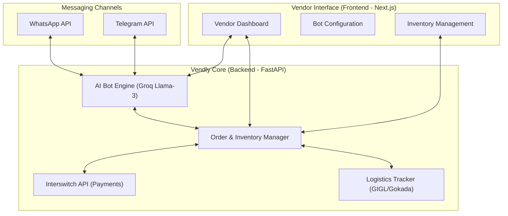

# Vendly: AI-Powered "Employee as a Service" for Vendors

Vendly is a comprehensive platform designed to empower vendors of all types—from small-scale restaurants to established boutique owners—by providing them with an intelligent AI bot (WhatsApp or Telegram) that acts as their virtual employee. Powered by **Groq's Llama-3 AI Engine**, this assistant is capable of handling discovery, technical verification, consultations, logistics, and even "smart haggling" to close sales autonomously.

## Core Features

### 1. Multi-Channel Bot Support
- **WhatsApp & Telegram Integration:** Vendors can set up automated bots that live on popular messaging platforms where their customers already are.
- **Natural Language Interaction:** Customers can chat with the bot just as they would with a human employee.

### 2. Intelligent Product Discovery & Consultation
- **Descriptive Discovery:** Users can ask for items based on descriptions (e.g., "floral maxi dress for a garden wedding") rather than needing direct links.
- **Technical Specs Verification:** The bot can provide detailed specs for high-value items like electronics, ensuring the customer gets exactly what they need.
- **Consultative Selling:** In niches like beauty and skincare, the bot can act as a consultant, recommending products based on the customer's current needs, **variants (colors, sizes)**, and providing **product reviews/images** for technical verification.

### 3. Inventory & Logistics Management
- **Real-time Stock Checks:** The bot can verify if an item is available in a specific size or variant.
- **Shipping Calculation:** Automated quotes for complex orders, including weight-based fees for bulk items or special handling fees for difficult delivery locations (e.g., apartments with no lift).
- **Automated Tracking:** Customers can retrieve waybill numbers and live status updates for their shipments directly from the chat.

### 4. Smart Transactional Capabilities
- **Campaign-Led Negotiation:** To ensure speed and vendor control, vendors can pre-define **Coupon Codes** and **Voucher Campaigns** on the dashboard. The AI is authorized to offer these codes autonomously during a conversation if the customer asks for a discount and meets the vendor's criteria (e.g., "First-time buyer discount").
Vendly AI: "Welcome! 🌸 We have a few options that fit that vibe perfectly. I'd recommend our 'Aurelia Chiffon Maxi' in Pastel Floral or the 'Summer Breeze' wrap dress. Would you like to see photos of those?"

Customer: "Yes, send the Aurelia one. Is it available in UK 14?"

Vendly AI: "Checking stock... Yes, we have the Aurelia in UK 14! It’s a great fit for garden events. It goes for ₦25,000. Should I set aside one for you?"
- **Secure Payment Integration:** Generation of Interswitch payment links for card payments and bank transfers.
- **FastTrack Logistics:** Option to flag urgent orders for "Instant Dispatch" with additional express fees.

### 5. Escalation & Human Takeover
- **Intelligent Flagging:** The bot recognizes when a query is too complex (e.g., ZIP breakage, refund/dispute) and alerts the human manager.
- **Vendor Dashboard:** A centralized place for vendors to take over chats, manage orders, **manage earnings/payouts**, and **update bot profiles (Telegram name/photo)**.

---

## Business Scenarios

The AI is designed to handle diverse industries and complex customer interactions:

| Scenario | Sector | Key Capabilities Used |
| :--- | :--- | :--- |
| **Floral Maxi Dress** | Fashion | Discovery, sizing, stock check, colloquial processing ("Abeg"). |
| **Sony XM5 Headphones** | Electronics | Technical verification, international version check, Lagos free delivery. |
| **Harmattan Skincare** | Beauty | Consultation, ingredients check, combo bundling. |
| **Bulk Rice Order** | Groceries | Weight-based shipping, manual quote calculation. |
| **Bag Haggling** | General | Discount negotiation, "Flash Discount" application. |
| **Order Tracking** | Logistics | Waybill verification, GIGL status updates. |
| **Sofa Delivery** | Furniture | Handling/stairs fee verification, manual labor calculation. |
| **Virtual Account Transfer** | Fintech | Bank transfer preference, Interswitch integration. |
| **Last Minute Gift** | Gift Shop | Express dispatch, deadline management. |
| **Zip Breakage/Return** | Service | Human takeover protocol, internal notification. |

## User Flow
1. **Signup:** Vendor joins Vendly and connects their product inventory.
2. **Bot Setup:** Vendor configures their WhatsApp or Telegram credentials.
3. **Engagement:** Customers message the bot to discover, enquire, and order.
4. **Fulfillment:** AI handles payment and initiates logistics coordination.
5. **Human Takeover:** Vendor intervenes only when flagged or manually desired.

## System Architecture

